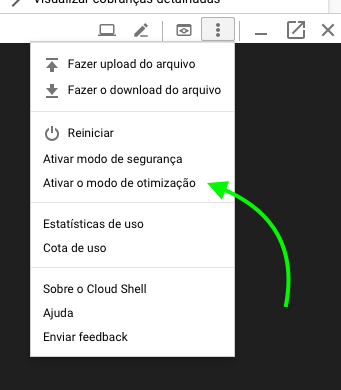

# Deploy do seu classificador fastai no Heroku como um Web App

Existem várias formas de colocar na Internet o seu classificador baseado em fastai. A página de informações do curso mostra diversas opções:

* [Render](https://course.fast.ai/deployment_render.html)
* [Google App Engine](https://course.fast.ai/deployment_google_app_engine.html)
* [AWS Lambda](https://course.fast.ai/deployment_aws_lambda.html)
* [Amazon SageMaker](https://course.fast.ai/deployment_amzn_sagemaker.html)
* [AWS BeanStalk](https://course.fast.ai/deployment_aws_beanstalk.html)
* [Microsoft Azure Functions](https://course.fast.ai/deployment_azure_functions.html)

Com certeza, uma opção que se destaca é o Render.com ([tutorial online]((https://course.fast.ai/deployment_render.html))), 
que é uma plataforma criada pelo mesmo criador do [Crestle](https://crestle.ai/) mas uma outra opçao é usar gratuitamente o Heroku.

## 1) Exporte o modelo treinado

Gere o seu modelo normalmente e salve o `export.pkl` `com learn.export()`.

Coloque que arquivo no google drive ou dropbox (porque é de graça). É necessário gerar um link para o arquivo usando um dos dois serviços abaixo:

- Google Drive: Use [este gerador de links](https://www.wonderplugin.com/online-tools/google-drive-direct-link-generator/).
- Dropbox: Use [este gerador de links](https://syncwithtech.blogspot.com/p/direct-download-link-generator.html).

## 2) Ajuste a aplicação pré-pronta

Faça um fork no github deste repositório base, que contém uma aplicação pré-pronta e customizável.

Edite, no próprio Github, o arquivo `[app/server.py](https://github.com/piegu/glasses-or-not/blob/master/app/server.py)` para incluir:

1. O endereço do `export.pkl` em `export_file_url`.
2. Troque o nome das classes geradas pelo seu modelo em `classes = ['with_glasses', 'without_glasses']
3. Lembre-se de usar a opção "Commit directly to the master branch".
4. Edite também o texto que aparece para os usuários da sua aplicação, no arquivo `[app/views/index.html](https://github.com/piegu/glasses-or-not/blob/master/app/view/index.html):`
    1. O título (tag `<title>`)
    2. O cabeçalho (`div class='title'`) e a explicação (tag `
`)
5. E pronto!

## 3) Deploy no Heroku

Apesar de ser gratuito, o deploy no Heroku exige passos adicionais, que devem ser repetidos manualmente **sempre que o código da aplicação for alterado na Github**.

Normalmente o deploy no Heroku exige apenas o código da aplicação, mas, no caso dos modelos do fastai, ela é grande demais para o método tradicional e exige o **deploy em containers docker**. Para isso, é necessário executar os comandos numa máquina com docker instalado.

No entanto, como estamos usando uma máquina do Google Cloud para gerar o modelo, podemos usar o Cloud Shell para fazer o deploy.

### 3.1) Acesse o console do Google Cloud

Os passos a seguir consideram que você já tem uma conta no gcloud.

1. Acesse o dashboard em [https://console.cloud.google.com/home/dashboard](https://console.cloud.google.com/home/dashboard).
2. Abra o Cloud Shell no topo da página:

    

3. Ative o modo de otimização. Ele faz com que o Cloud Shell rode numa máquina mais potente e permita o build do container.

    

4. Instale o cliente da heroku:

    `curl https://cli-assets.heroku.com/install.sh | sh`

    

5. Faça o clone da aplicação modificada e entre no diretório.
    Note que o seu endereço vai ser diferente do meu.

    `git clone https://github.com/weltonrodrigo/fastai-v3.git`

    

6. Faça o login no heroku:

    `heroku login`
    
    O cliente heroku vai pedir que você aperte enter e depois apresentar um link para ser aberto na internet. Esse link vai te levar para a página de login. Nessa tela você pode fazer seu cadastro se ainda não tiver. Depois da autenticação bem sucedida, o cliente vai informar que está logado.

    

7. Crie um novo app no Heroku para receber sua aplicação:

    `heroku create nome-da-aplicacao`

    O nome da aplicação também vai ser o endereço dela na internet. No exemplo acima, seria nome-da-aplicacao.app.herokuapp.com. Caso você não queira um nome específico, ele vai criar um nome aleatório.

    

8. É necessário informar ao cliente docker como fazer o login no heroku, mas o próprio cliente toma conta disso:

    `heroku container:login`

    

9. Agora para construir e enviar o container para o heroku:
Isso deve levar em torno de 5 minutos. O print abaixo mostra só o começo do texto de saída gerado pelo comando.

    `heroku container:push web`

    

    Se a construção e envio forem bem sucedidos, deve gerar uma saída parecida com esta:

    

10. Agora é necessário informar o keroku que faça o deploy propriamente dito do container criado:

    `heroku container:release web`

    

11. O aplicativo já estará disponível https://<nome_da_aplicação>.herokuapp.com. No nosso exemplo em https://testedoherokufastai.herokuapp.com.

## Deploy no Google Cloud Run

O Google Cloud tem também agora uma forma simplificada de fazer deploys. Um pouco mais complicado que o Render, mais simples que o Heroku.

Partindo do pressuposto de que você já está com acesso ao Google Cloud, procure pelo serviço [Build](https://console.cloud.google.com/cloud-build/builds) e:

]

1. Crie um novo acionador em [https://console.cloud.google.com/cloud-build/triggers](https://console.cloud.google.com/cloud-build/triggers)
2. Utilize o seu repositório no Github como fonte para esse acionador, alterando apenas o nome da imagem criada. O padrão do cloud build é construir a imagem usando o hash do commit, mas é mais simples utilizar a *tag* latest.
3. Agora, sempre que o seu código no github for alterado, o cloud build constrói uma nova versão do seu container.

Uma vez que o container tenha sido criado, ele fica disponível para receber o deploy no [Cloud Run](https://console.cloud.google.com/run):

1. Crie um novo serviço utilizando a imagem de container criada no passo anterior.
2. Certifique-se de marcar a opção de permitir chamadas não autenticadas, ou a sua aplicação irá ficar acessível apenas a outros serviços dentro da nuvem do google.
3. Aumente o limite de memória para 2gb, para que seu modelo seja corretamente carregado pelo fastai e consiga realizar as inferências.

O deploy de alterações não é automático, mas é tão simples quanto entrar nos detalhes do servidor no Cloud Run e usar o botão Deploy New Revision.

